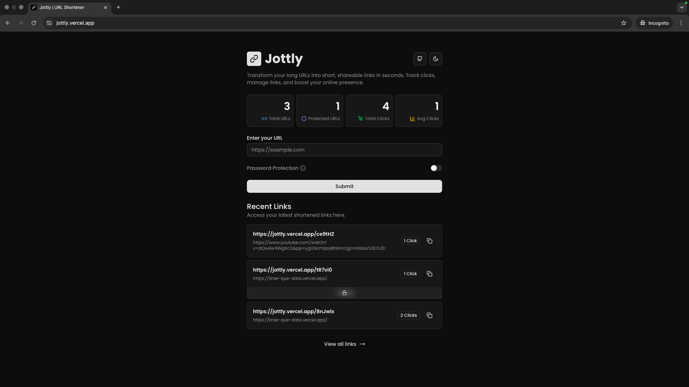

# Jottly [Next.js]



**Jottly** is a modern, open-source URL shortener built with Next.js, Drizzle ORM, PostgreSQL, and more. Create, manage, and track short links with privacy and speed. No authentication required—just shorten and share!

[Live Demo](https://jottly.vercel.app)

## 🚀 Features

- **Shorten URLs**: Instantly generate short links for any URL.
- **Password Protection**: Secure your links with a password.
- **Analytics**: Track clicks, total URLs, protected URLs, and average clicks.
- **Expiration**: Links expire after 30 days for privacy.
- **No Sign Up Needed**: Use all features without creating an account.
- **Recent Links**: View your latest shortened URLs.
- **QR Codes**: Download QR codes for your links.
- **Copy to Clipboard**: Easily copy your short links.

## 🛠️ Tech Stack

- [Next.js](https://nextjs.org/)
- [TanStack React Query](https://tanstack.com/query/latest)
- [Axios](https://axios-http.com/)
- [Shadcn UI](https://ui.shadcn.com/)
- [Drizzle ORM](https://orm.drizzle.team/)
- [PostgreSQL](https://www.postgresql.org/)
- [Docker](https://www.docker.com/)
- [Supabase](https://supabase.com/) (optional for hosting)

## 📦 Getting Started

### 1. Clone the Repository

```bash
git clone https://github.com/WannaCry081/Jottly-App.git
cd jottly-app
```

### 2. Install Dependencies

```bash
pnpm install # or npm install or yarn install
```

### 3. Configure Environment Variables

- Copy `.env.example` to `.env` and fill in the required values:

```bash
cp .env.example .env
```

- Set your database URL and secret key.

### 4. Run with Docker (Recommended)

```bash
docker compose up
```

Or run locally:

```bash
pnpm dev
```

## 🧪 Usage

- Visit [http://localhost:3000](http://localhost:3000) to use the app locally.
- Shorten URLs, protect with passwords, and track analytics instantly.

## 🤝 Contributing

Contributions are welcome! To get started:

1. **Fork** the repository
2. **Create a new branch**: `git checkout -b feature/YourFeature`
3. **Commit your changes**: `git commit -am 'feat: add new feature'`
4. **Push to your branch**: `git push origin feature/YourFeature`
5. \*\*Open a Pull Request`

> Please follow [Conventional Commits](https://www.conventionalcommits.org/) for commit messages.

## 📬 Contact

- **Email**: liraedata59@gmail.com
- **GitHub**: [WannaCry081](https://github.com/WannaCry081)
